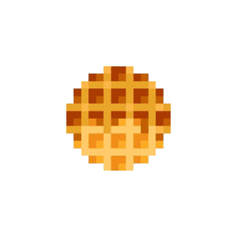

<div align="center">
        
    <br/>
    <a href="https://git.io/typing-svg"></a>
</div>

<div align="center">
    <a href="https://gitlab.waffly.xyz"></a>
    <a href="https://blog.waffly.xyz"></a>
    <a href="https://www.youtube.com/@WaffleYTChannel"></a>
    <a href="https://orcid.org/0009-0007-2403-4984"></a>
</div>

<div align="center" justify-content="space-between">
    <a href="./README-KR.md"></a>
	<a href="./README.md"></a>
</div>

<div align="center">
    <a href="https://github.com/sponsors/Waffle0823"></a>
</div>

---

### About Me

```
OS:             Arch Linux
Current:        Exploring Raylib with C++
Proficient:     Luau, TypeScript/JavaScript
Mid-level:      C#
Learning:       C++
```

### Tech Stack & Tools

- **Build Tools:** CMake, Git
- **Backend:** Supabase, PostgreSQL
- **Languages:** Luau, TypeScript, JavaScript, C#, C++

### Open Source Projects

- [Roblox-Supabase](https://github.com/Waffle0823/Roblox-Supabase) - Supabase integration for Roblox
- [SteamworksSDK](https://github.com/Waffle0823/SteamworksSDK) - Steamworks SDK wrapper
- [SteamworksSDK-Mirror](https://github.com/Waffle0823/SteamworksSDK-Mirror) - Mirror repository for SteamworksSDK

---

<div align="center">
    
    
</div>

<div align="center">
    
    
    
</div>
